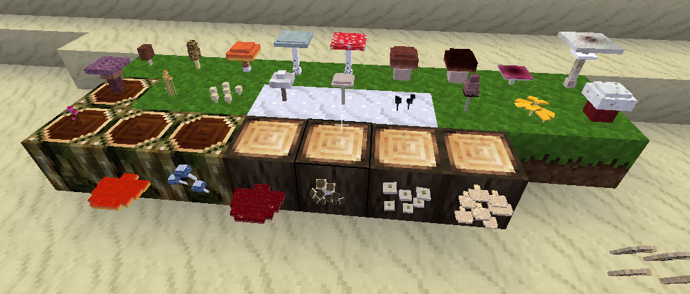

Not So Simple Plants and Fungi
==============================

NSSPF mod that adds wild plants (fungies)

Information
------------

A mod that adds wild plants and fungi in order to give another 
source of food without farming, but with possible dangerous if you 
dont take care of thems. For now there are only 29 fungi and no plants.

You just have to walk around in the different biomes and gather the fungi.

All the fungi are taken from the real world and thay have their scientific names. Many of them are good to eat, but others can be lethal.



## Technical info
-----------------

There are 5 types of fungi:

* Ectomycorrhizal fungi: grows in association with the roots of trees, the mycelium grows in the ground and sometimes a mushroom will grow.
* There are also truffles, hard to find (truffles are produced underground)
* Saprobiontic fungi: divided in 4 categories distiguished by where they grow
    * Jungle fungi grow on trees trunks in the jungle.
    * Grass fungi grow as mycelium underground in grassland and sometimes produce a mushroom on the surface.
    * Snowbank fungi act as grass fungi but under the snow.
    * Tree fungi as jungle fungi grow on trees trunks of trees and pine trees.

For more information **check specific node list in the [nodes](#nodes) section** 
below.

It is possible to farm the fungi with the spores. Exposed to air mycelium will 
die and the dirt left may contain spores, dropped when digged.

For saprobiontic is necessary to click with the spores the ground (`dirt_with_grass` or `dirt_with_snow`) 
to grow a new mycelium under the node. Ectomycorrhizal fungi spores need to 
placed on the bottom of the right trunk of a tree, each fungus need a 
specific tree.

Many mushrooms are hard to digest so it is better to cook them before eating, 
in order to appreciate their nutritional value fully. Cooking could also 
inactivate the toxin in poisonous fungi (only in some of them obviously!). 
In other cases cooking may damage the beneficial propreties of the mushrooms 
reducing their nutritional value.

#### Dependencies

* default
* nssm (optional)
* tnt (optional)

#### ABMs

Fungi are generated by ABM, so their growth will require some time.

This mod originally was made using many ABMs so may cause lag in low end devices.

#### Nodes


| node                                 | Description                    | fuel | cooked       |
| ------------------------------------ | ------------------------------ | ---- | ------------------ |
| nsspf:amadou                         |  Amadou                        | yes  |     |
| nsspf:lasting_amadou                 | Lasting Amadou                 | yes  |     |
| nsspf:long_lasting_amadou            | Long Lasting Amadou            | yes  |     |
| nsspf:boletus_edulis                 |  Boletus edulis                | yes  | yes |
| nsspf:cooked_boletus_edulis          |  Cooked Boletus edulis         |      | yes |
| nsspf:boletus_edulis_fungusdirt      |  Boletus edulis Dirt           |      |     |
| nsspf:cantharellus_cibarius          |  Cantharellus cibarius         | yes  | yes |
| nsspf:cooked_cantharellus_cibarius   |  Cooked Cantharellus cibarius  |      |     |
| nsspf:cantharellus_cibarius_fungusdirt |  Cantharellus cibarius Dirt  |      |     |
| nsspf:suillus_grevillei              |  Suillus grevillei             | yes  | yes |
| nsspf:cooked_suillus_grevillei       |  Cooked Suillus grevillei      |      |     |
| nsspf:suillus_grevillei_fungusdirt   |  Suillus grevillei Dirt        |      |     |
| nsspf:morchella_conica               |  Morchella conica              | yes  | yes |
| nsspf:cooked_morchella_conica        |  Cooked Morchella conica       |      |     |
| nsspf:morchella_conica_fungusdirt    |  Morchella conica Dirt         |      |     |
| nsspf:russula_xerampelina            |  Russula xerampelina           | yes  | yes |
| nsspf:cooked_russula_xerampelina     |  Cooked Russula xerampelina    |      |     |
| nsspf:russula_xerampelina_fungusdirt |  Russula xerampelina Dirt      |      |     |
| nsspf:boletus_pinophilus             |  Boletus pinophilus            | yes  | yes |
| nsspf:cooked_boletus_pinophilus      |  Cooked Boletus pinophilus     |      |     |
| nsspf:boletus_pinophilus_fungusdirt  |  Boletus pinophilus Dirt       |      |     |
| nsspf:boletus_satanas                |  Boletus satanas               | yes  | yes |
| nsspf:cooked_boletus_satanas         |  Cooked Boletus satanas        |      |     |
| nsspf:boletus_satanas_fungusdirt     |  Boletus satanas Dirt          |      |     |
| nsspf:amanita_phalloides             |  Amanita phalloides            |      | yes |
| nsspf:cooked_amanita_phalloides      |  Cooked Amanita phalloides     |      |     |
| nsspf:amanita_muscaria_fungusdirt    |  Amanita muscaria Dirt         |      |     |
| nsspf:amanita_muscaria               |  Amanita muscaria              | yes  | yes |
| nsspf:cooked_amanita_muscaria        |  Cooked Amanita muscaria       |      |     |
| nsspf:amanita_phalloides_fungusdirt  |  Amanita phalloides Dirt       |      |     |
| nsspf:tuber_melanosporum_fungusdirt  |  Tuber melanosporum Dirt       |      |     |
| nsspf:tuber_magnatum_pico_fungusdirt |  Tuber magnatum pico Dirt      |      |     |
| nsspf:tuber_borchii_fungusdirt       |  Tuber borchii Dirt            |      |     |
| nsspf:terfezia_arenaria_fungusdirt   |  Terfezia arenaria Dirt        |      |     |
| nsspf:fistulina_hepatica             |  Fistulina hepatica            | yes  | yes |
| nsspf:cooked_fistulina_hepatica      |  Cooked Fistulina hepatica     |      |     |
| nsspf:armillaria_mellea              |  Armillaria mellea             | yes  | yes |
| nsspf:cooked_armillaria_mellea       |  Cooked Armillaria mellea      |      |     |
| nsspf:fomes_fomentarius              |  Fomes fomentarius             |      |     |
| nsspf:mycena_chlorophos              |  Mycena chlorophos             | yes  | yes |
| nsspf:cooked_mycena_chlorophos       |  Cooked Mycena chlorophos      |      |     |
| nsspf:mycena_chlorophos_light        |  Nocturn Mycena chlorophos     |      |     |
| nsspf:panellus_pusillus              |  Panellus pusillus             | yes  | yes |
| nsspf:cooked_panellus_pusillus       |  Cooked Panellus pusillus      |      |     |
| nsspf:panellus_pusillus_light        |  Nocturn Panellus pusillus     |      |     |
| nsspf:macrolepiota_procera           |  Macrolepiota procera          |      | yes |
| nsspf:cooked_macrolepiota_procera    |  Cooked Macrolepiota procera   |      |     |
| nsspf:macrolepiota_procera_fungusdirt |  Macrolepiota procera Dirt    | yes  |     |
| nsspf:psilocybe_cubensis             |  Psilocybe cubensis            | yes  |     |
| nsspf:cooked_psilocybe_cubensis      |  Cooked Psilocybe cubensis     |      |     |
| nsspf:psilocybe_cubensis_fungusdirt  |  Psilocybe cubensis Dirt       |      |     |
| nsspf:lycoperdon_pyriforme           |  Lycoperdon pyriforme          | yes  | yes |
| nsspf:cooked_lycoperdon_pyriforme    |  Cooked Lycoperdon pyriforme   |      |     |
| nsspf:lycoperdon_pyriforme_fungusdirt |  Lycoperdon pyriforme Dirt    |      |     |
| nsspf:gyromitra_esculenta            |  Gyromitra esculenta           | yes  | yes |
| nsspf:cooked_gyromitra_esculenta     |  Cooked Gyromitra esculenta    |      |     |
| nsspf:gyromitra_esculenta_fungusdirt |  Gyromitra esculenta Dirt      |      |     |
| nsspf:coprinus_atramentarius         |  Coprinus atramentarius        |      | yes |
| nsspf:cooked_coprinus_atramentarius  |  Cooked Coprinus atramentarius |      |     |
| nsspf:coprinus_atramentarius_fungusdirt  |  Coprinus atramentarius Dirt |    |     |
| nsspf:lentinus_strigosus             |  Lentinus strigosus            | yes  | yes |
| nsspf:cooked_lentinus_strigosus      |  Cooked Lentinus strigosus     |      |     |
| nsspf:ganoderma_lucidum              |  Ganoderma lucidum             | yes  | yes |
| nsspf:cooked_ganoderma_lucidum       |  Cooked Ganoderma lucidum      |      |     |
| nsspf:marasmius_haematocephalus      |  Marasmius haematocephalus     | yes  | yes |
| nsspf:cooked_marasmius_haematocephalus  |  Cooked Marasmius haematocephalus  |      |     |
| nsspf:clitocybula_azurea             |  Clitocybula_azurea            | yes  | yes |
| nsspf:cooked_clitocybula_azurea      |  Cooked Clitocybula_azurea     |      |     |
| nsspf:clitocybe_glacialis            |  Clitocybe glacialis           | yes  | yes |
| nsspf:cooked_clitocybe_glacialis     |  Cooked Clitocybe glacialis    |      |     |
| nsspf:clitocybe_glacialis_fungusdirt |  Clitocybe glacialis Dirt      |      |     |
| nsspf:hygrophorus_goetzii            |  Hygrophorus goetzii           | yes  | yes |
| nsspf:cooked_hygrophorus_goetzii     |  Cooked Hygrophorus goetzii    |      |     |
| nsspf:hygrophorus_goetzii_fungusdirt |  Hygrophorus goetzii Dirt      |      |     |
| nsspf:plectania_nannfeldtii          |  Plectania nannfeldtii         | yes  | yes |
| nsspf:cooked_plectania_nannfeldtii   |  Cooked Plectania nannfeldtii  |      |     |
| nsspf:plectania_nannfeldtii_fungusdirt  |  Plectania nannfeldtii Dirt |      |     |

#### Crafts

nsspf:amadou

```
	{'nsspf:fomes_fomentarius'}
```

nsspf:long_lasting_amadou',

```
	{'nssm:black_powder', 'nsspf:amadou'
```

nsspf:lasting_amadou',

```
	{'tnt:gunpowder', 'nsspf:amadou'},
```
#### Original information

https://forum.minetest.net/viewtopic.php?t=16345

## License:

(c) 2014-2016 NPXcoot

* LGPLv3 for the code
* CC BY-SA 4.0 for the models and textures

(c) 2023 mckaygerhard

* CC BY-SA NC 4.0 for additions, code fixed and improvements

